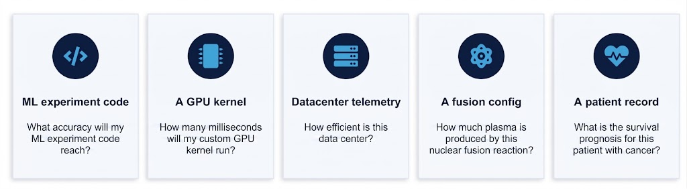
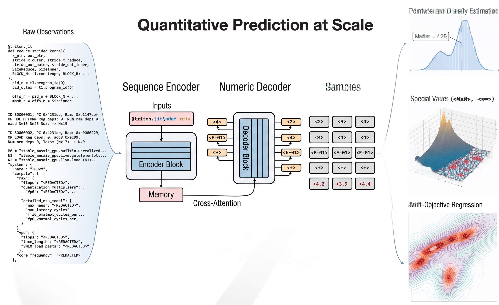

<!-- MathJax for LaTeX rendering -->

    

        <!-- TODO: Update author list -->
        <b>Author 1</b>1,
        <b>Author 2</b>1,
        <b>Author 3</b>1,
        <b>Author 4</b>1
    

    

        1Google DeepMind
    

    

        <a href="https://arxiv.org/abs/XXXX.XXXXX">📄 Paper</a>
        <a href="https://github.com/google-deepmind/regress-lm">💻 Code</a>
        
    

## Intro
Given an observation of a complex system, **what number(s) will it produce?**

<!-- Replace with slide table?
This question always arises across science and engineering. For example:

* What accuracy will my ML experiment code reach?
* How many milliseconds will my custom GPU kernel run?
* How efficient is this data center?
* How much plasma is produced by this nuclear fusion reaction?
* What is the survival prognosis for this patient with cancer?
-->

Historically, entire fields have traditionally resorted to _tabular regression_, which represents all worldly information as tables, or precisely, normalized fixed-dimensional vectors. But the world isn't a table, and tabular methods can't be applied to code, logs, or free-form text, which possesses arbitrary _sequence_ lengths.

We instead represent numeric prediction as a **sequence-to-sequence transduction** problem.

## Method Overview
An encoder-decoder converts tokens to tokens, from one information space (the raw observations of the world) into another, the spaces of all real numbers. Inputs $x$ can be represented as-is, and output numbers $y$ can stay unnormalized:

* By using **cross-attention** (instead of compressive embeddings attached to a tabular head), information is preserved and even allows approximating any _computable function._
* By training with **cross-entropy** loss over numeric targets, we smoothly learn any density $p(y \mid x)$ to express epistemic and aleatoric uncertainty properly.
* By applying at scale, we can perform enormous amounts of transfer-learning over any (x,y) data pairs.

At inference, decoding numbers essentially allows us to perform intuitive, or _inductive reasoning_ about the world.

## Applications

<!-- Interactive application viewer (disco_rl style) -->

    

        

            <h3>Predicting ML Experiments from Code</h3>
            
Kaggle Experiment Scores

        

        

            <h3>Hyperparameter Optimization Reduction</h3>
            
Up to 100x fewer experiments needed

        

        

            <h3>Simplifying Neural Architecture Search</h3>
            
Zero expertise needed, still achieve 48% against SoTA

        

        

            <h3>GPU Kernel Latency and Optimization</h3>
            
16-100x fewer trials needed

        

        

            <h3>Static Analysis</h3>
            
24+ different languages covered

        

        

            <h3>CPU Microarchitecture Simulation</h3>
            
Explore

        

        

            <h3>TPU Pareto Frontier Generation</h3>
            
Pareto Frontiers for TPU Co-Design

        

        

            <h3>Data Center Efficiency Prediction</h3>
            
From raw telemetry logs

        

        

            <h3>Nuclear Fusion Surrogates</h3>
            
First to predict from code

        

    

    

        <!-- TODO: Replace placeholder images with actual figures -->
        

            
        

        

            
        

        

            
        

        

            
        

    

<!-- Image modal for full-screen view -->

    &times;
    

## Citation

If you find this work useful, please cite:

<!-- TODO: Update with actual Nature citation -->
@article{todo,
    title={TODO},
    author={TODO},
    journal={TODO},
    year={TODO}
}

 

---

<b>Disclaimer:</b> This is not an officially supported Google product.

