

<!-- MathJax for LaTeX rendering -->

    

        
            <b>Xingyou (Richard) Song</b><b>1</b>,<b>†</b>,<b>*</b>,
            <b>Yash Akhauri</b><b>2</b>,<b>3</b>,<b>†</b>,<b>*</b>,
            <b>Jiyoun (Jen) Ha</b><b>4</b>,<b>5</b>,<b>*</b>,
            <b>Bryan Lewandowski</b><b>4</b>,<b>*</b>,
         
        <b>David Smalling</b><b>1</b>,
        <b>Jason Lowe-Power</b><b>4</b>,
        <b>Jonathan Citrin</b><b>1</b>,
        <b>David Lo</b><b>4</b>,
        <b>Rami Cohen</b><b>4</b>,
        <b>Julian Walker</b><b>1</b>,
        <b>Lai Wei</b><b>4</b>,
        <b>Subhashini Venugopalan</b><b>2</b>,
        <b>Mohamed Abdelfattah</b><b>3</b>,
        <b>Cheng-Hsi Lin</b><b>4</b>,
        <b>Bartłomiej Wróblewski</b><b>1</b>,
        <b>Suvinay Subramanian</b><b>4</b>,
        <b>Daiyi Peng</b><b>1</b>, 
        
            <b>Denny Zhou</b><b>1</b>,
            <b>Ed Chi</b><b>1</b>,
            <b>Quoc Le</b><b>1</b>,
            <b>Jeff Dean</b><b>1</b>,
            <b>Pushmeet Kohli</b><b>1</b>
        
    

    

        1Google DeepMind &nbsp;&nbsp;&nbsp;&nbsp;
        2Google Research &nbsp;&nbsp;&nbsp;&nbsp;
        3Cornell University &nbsp;&nbsp;&nbsp;&nbsp;
        4Google &nbsp;&nbsp;&nbsp;&nbsp;
        5Stanford University
    

    

        <b>†</b>Equal Lead. &nbsp;&nbsp;&nbsp;&nbsp; <b>*</b>Core Independent Contributor.
    

    

        <a href="https://arxiv.org/abs/XXXX.XXXXX">📄 Paper</a>
        <a href="https://github.com/google-deepmind/regress-lm">💻 Code</a>
        
    

## Intro
Given an observation of a complex system, **what number(s) will it produce?**
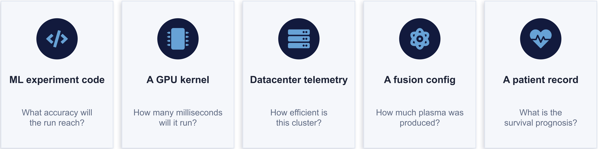

<!-- Make it a 10 = 2x5 to express the huge range?
* What accuracy will my ML experiment code reach?
* How many milliseconds will my custom GPU kernel run?
* How efficient is this data center?
* How much plasma is produced by this nuclear fusion reaction?
* What is the survival prognosis for this patient with cancer?
-->

Historically, entire fields have resorted to traditional _tabular regression_ which represents all information as tables, or precisely, normalized fixed-dimensional vectors. But the world isn't a table. Tabular methods can't be applied to data possessing arbitrary _sequence_ lengths, such as code, logs, or free-form text.

We instead represent numeric prediction as a **sequence-to-sequence** problem.

## Method Overview
A compact encoder-decoder converts, or _transduces_, from the space of all observations into another: the space of all real numbers.

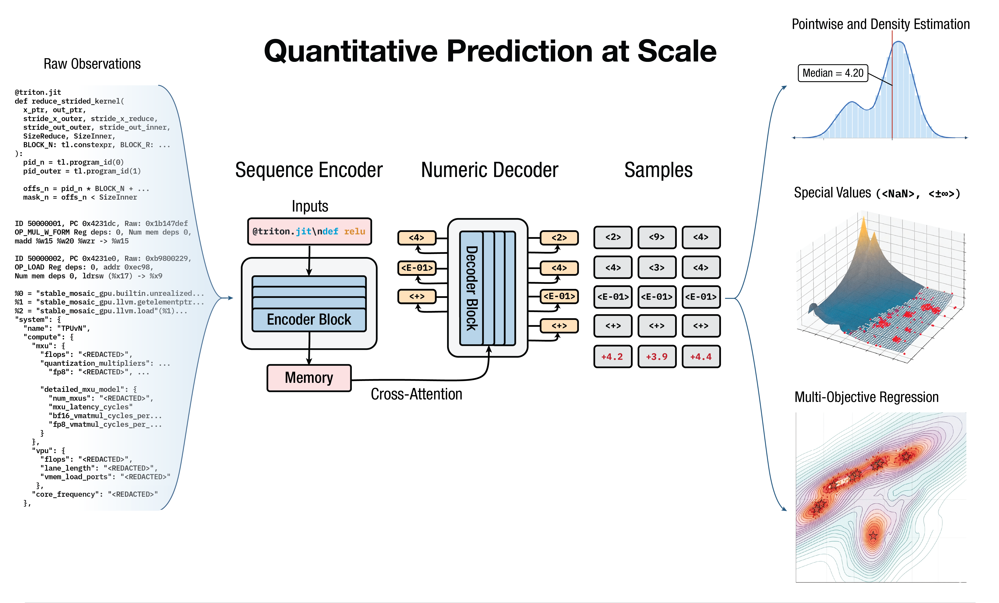

By:

* Expressing **token-by-token**, input observations $x$ can be represented as-is, and output numbers $y$ can stay unnormalized.
* Using **cross-attention** (instead of compressive embeddings attached to a tabular head), information is preserved and even allows approximating any _computable function._
* Training with **cross-entropy** loss over numeric targets, we smoothly learn any (possibly multi-objective) density $p(y \mid x)$ to express epistemic and aleatoric uncertainty properly.
* Scaling up and fine-tuning, we can perform enormous amounts of **transfer-learning** over any $(x,y)$ data pairs.

At inference, decoding numbers allows us to perform intuitive, or _inductive reasoning_ about the world.

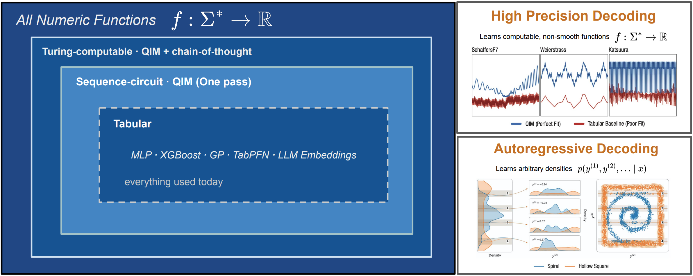

## Applications
Across 10 different high-impact scientific and industrial problems spanning experimental design, code execution, healthcare, and physics, each application achieves at least one of:

1. A new predictive capability not previously demonstrated.
2. Outperforms SoTA without domain-specific architecture or feature engineering.
3. Near-perfect simulation with at orders of magnitude lower cost.
4. Unified data scaling: Massive transfer-learning across different tasks.

<!-- Interactive application viewer (disco_rl style) -->

    

        

            <h3>Predicting ML Experiments from Code</h3>
            
Kaggle Experiment Scores

        

        

            <h3>Hyperparameter Optimization Reduction</h3>
            
Up to 100x fewer experiments needed

        

        

            <h3>Simplifying Neural Architecture Search</h3>
            
Zero expertise needed, achieve 48% against SoTA

        

        

            <h3>GPU Kernel Optimization</h3>
            
16-100x fewer trials needed

        

        

            <h3>Static Analysis for Memory</h3>
            
24+ different languages covered

        

        

            <h3>CPU Microarchitecture Simulation</h3>
            
Explore $10^{20}$ hardware configurations quickly

        

        

            <h3>TPU/LLM Pareto Frontier Generation</h3>
            
Latency + throughput tradeoffs for TPU/LLM co-design

        

        

            <h3>Data Center Efficiency</h3>
            
Prediction from raw telemetry logs

        

        

            <h3>Nuclear Fusion Surrogates</h3>
            
Novel inputs from raw code and configs

        

        

            <h3>Cancer Survival Prediction</h3>
            
Combine 9+ modalities into one model

        

    

    

        <!-- TODO: Replace images with powerpoint slides (consistent dimensions) -->
        

            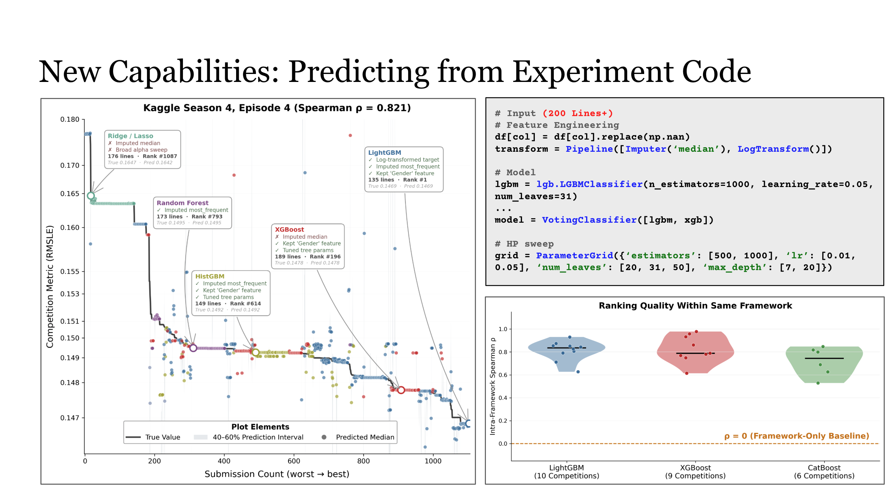
        

        

            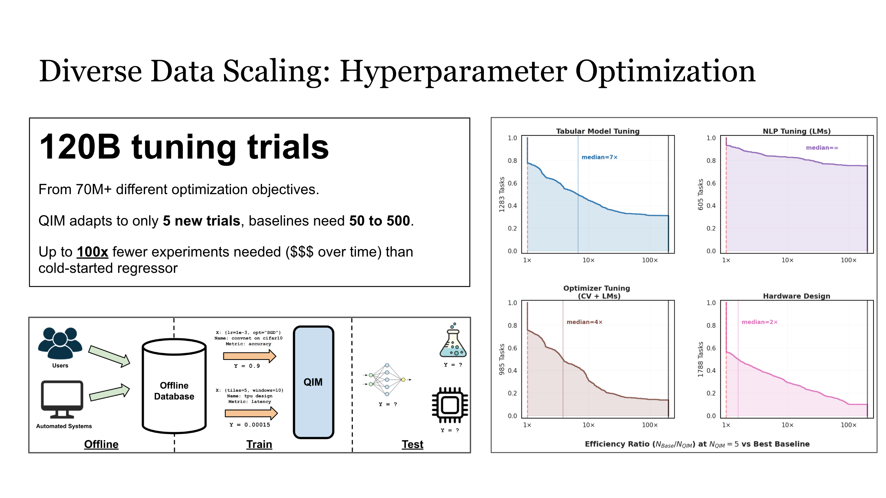
        

        

            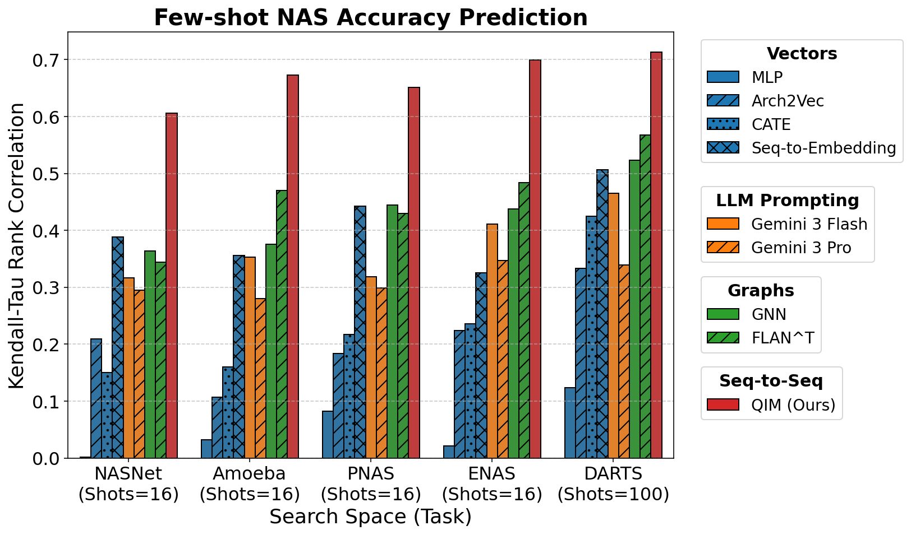
        

        

            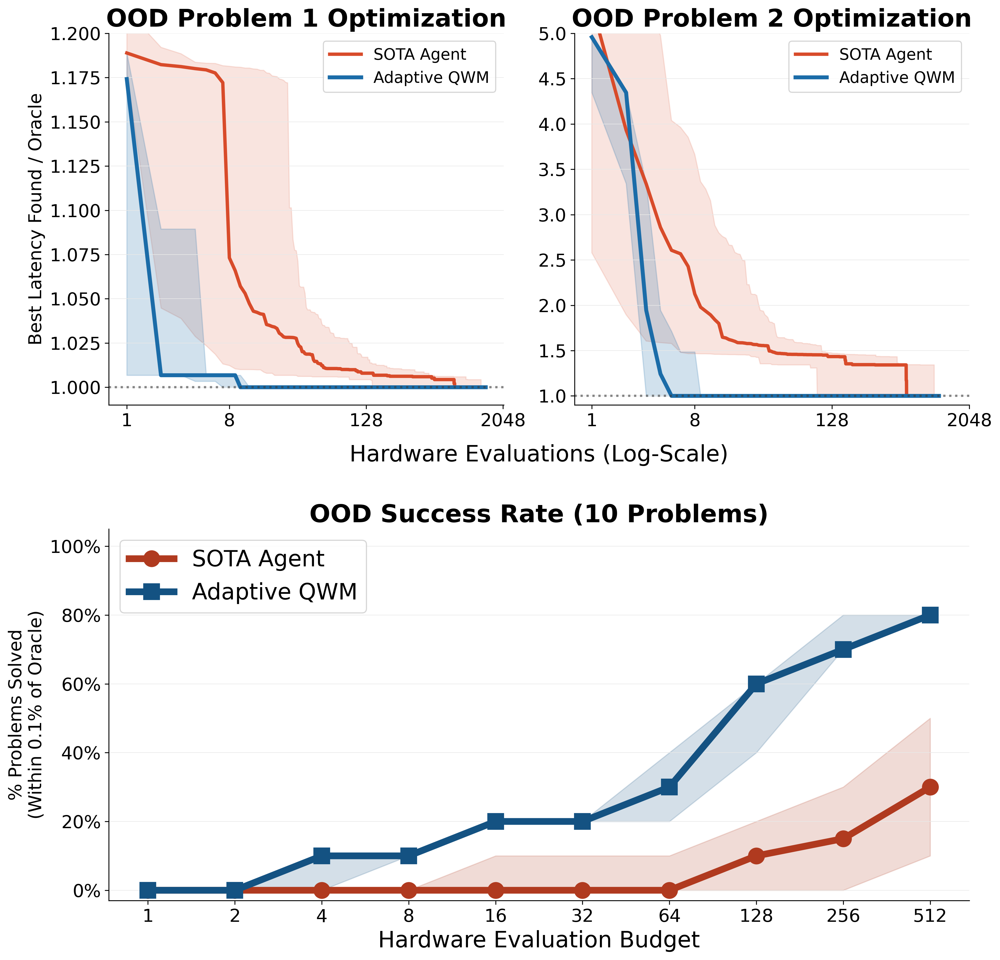
        

        

            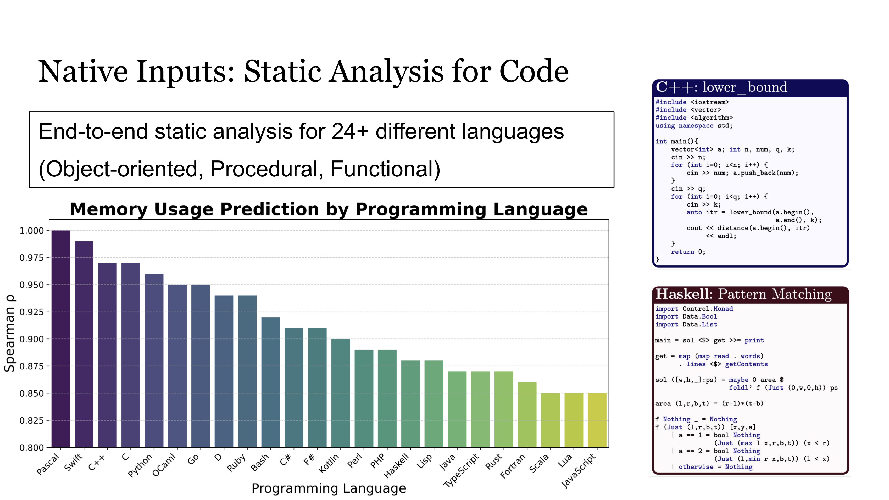
        

        

            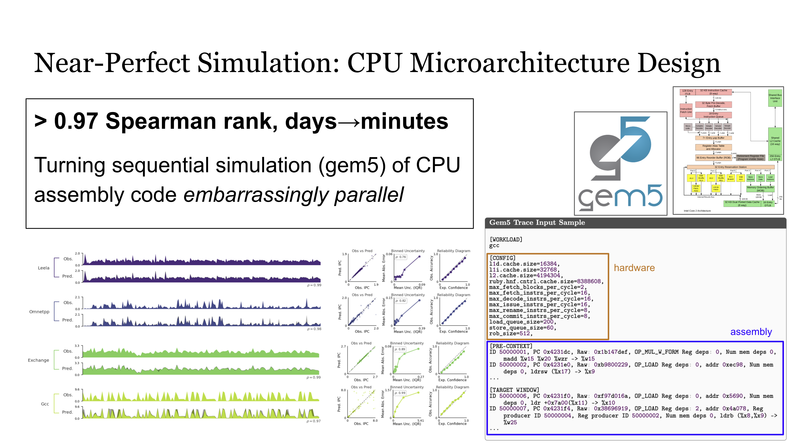
        

        

            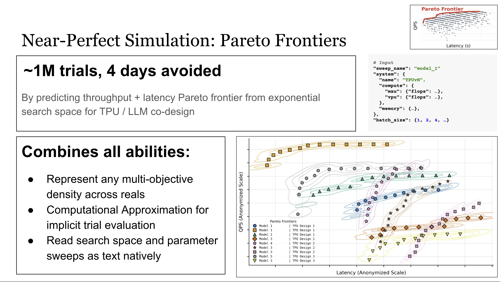
        

        

            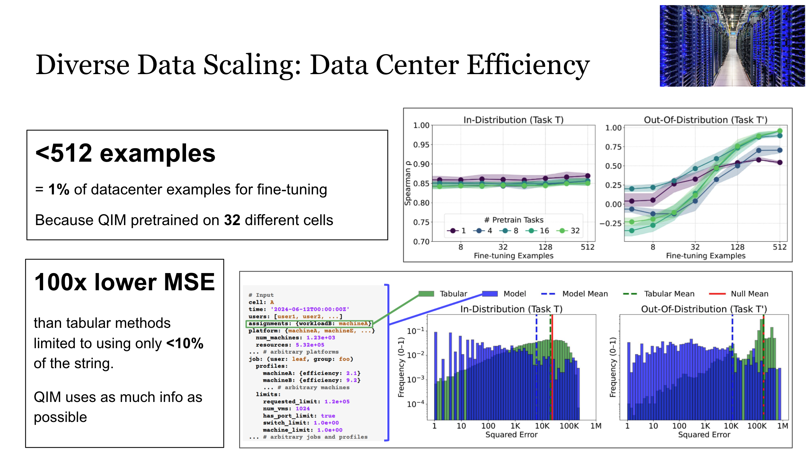
        

        

            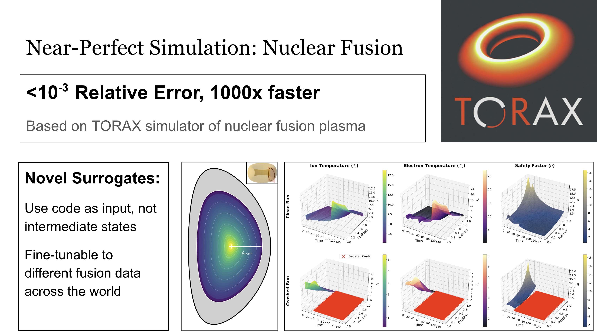
        

        

            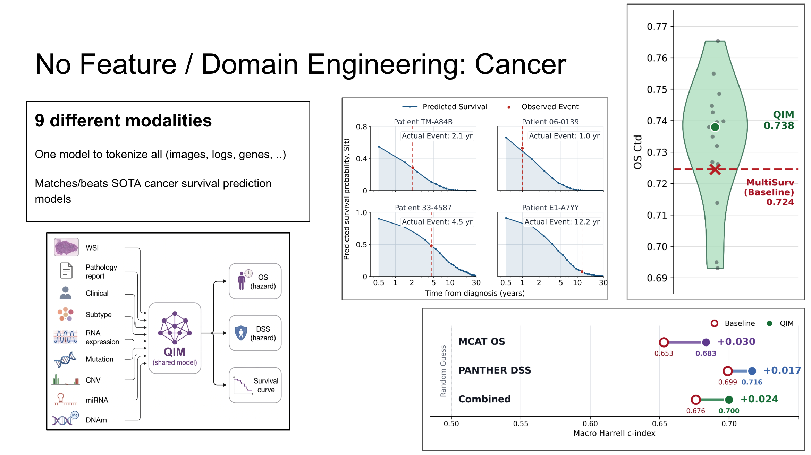
        

    

<!-- Image modal for full-screen view -->

    &times;
    

## Code Availability

Code can be found in the open-source package ([github.com/google-deepmind/regress-lm](https://github.com/google-deepmind/regress-lm)). The default model trains on a single H100 GPU with inputs of up to 32K tokens, and can be further made to run on consumer hardware by using single-layer encoders and decoders.

We provide the following Colabs and pretrained checkpoints for flagship result demos:

* **Synthetic Density:** [synthetic_density_demo.ipynb](https://github.com/google-deepmind/regress-lm/blob/main/colabs/synthetic_density_demo.ipynb).
* **ML Experiments from Code (Kaggle):** [kaggle_demo.ipynb](https://github.com/google-deepmind/regress-lm/blob/main/colabs/kaggle_demo.ipynb).
* **Triton GPU Kernels:** [triton_demo.ipynb](https://github.com/google-deepmind/regress-lm/blob/main/colabs/triton_demo.ipynb).

Pretraining data sources are listed in the paper.

## Acknowledgements

We thank Yutian Chen, Chen Sun, Vinh Tran, Alexander Rush, Michael Brenner, Dara Bahri, Yifeng Lu, Jonathan Lai, and Zhiyu Wei for early feedback, reviewing, and support of the manuscript.

We further thank Chen Liang, Oscar Li, Fred Zhang, Xuezhi Wang, Erik Lin, Esteban Real, Bangding (Jeffrey) Yang, Jarrod Kahn, Yiding Jiang, Samuel Sokota, Yan (Bill) Huang, Victor Reis, Phitchaya Mangpo Phothilimthana, Jörg Bornschein, Tejas Karkhanis, Amir Yazdan Bakhsh, Sami Abu-El-Haija, Erik Lin, Tung Nguyen, Eric Tang, Arissa Wongpanich, Shane Gu, Yingjie Miao, Qiuyi Zhang, Uri Alon, Shao-Hua Sun, Kuang-Huei Lee, Adrian N. Reyes, Zi Wang, Xinyun Chen, Aviral Kumar, Ke Xue, Rong-Xi Tan, Chansoo Lee, Michal Lukasik, Sagi Perel, and Daniel Golovin for relevant discussions.

We finally thank Parthasarathy Ranganathan, Amin Vahdat, Craig Donner, Martin Dixon, Shibl Mourad, Zoubin Ghahramani, and Benoit Schillings for support.

## Citation

If you find this work useful, please cite:

@article{todo,
    title={TODO},
    author={TODO},
    journal={TODO},
    year={TODO}
}

 

---

<b>Disclaimer:</b> This is not an officially supported Google product.

